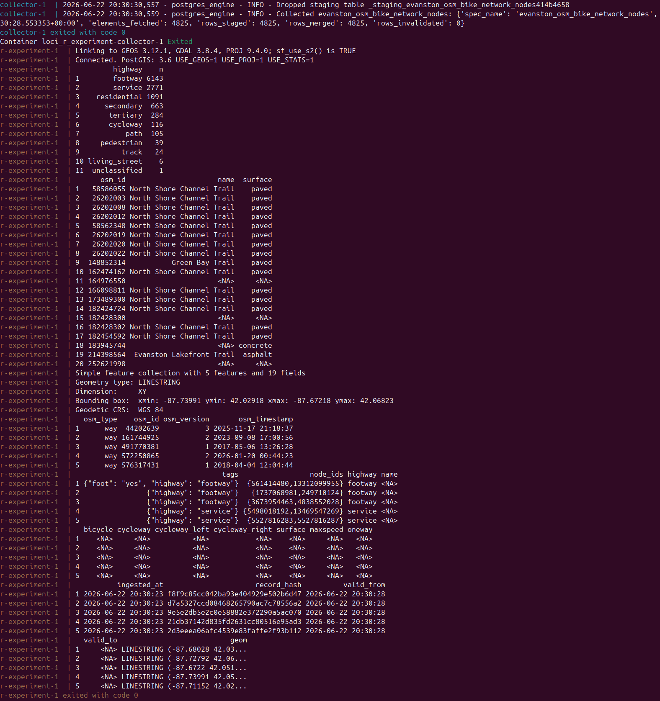
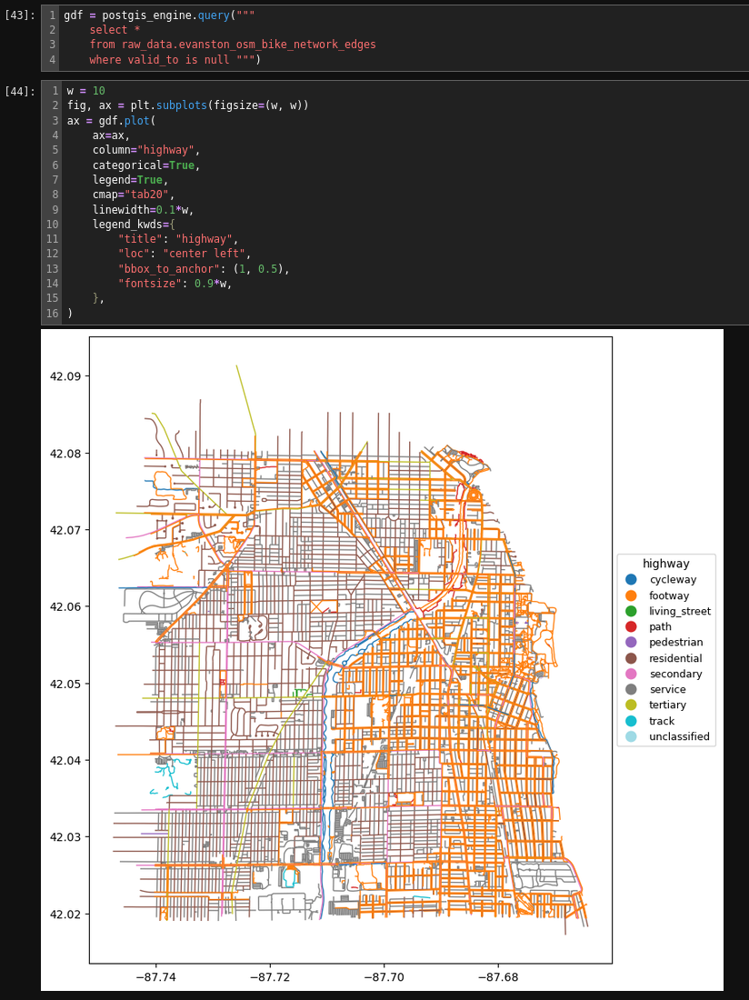

# Loci R Experiment

This is a simple workflow using the Loci_platform tooling that uses the `loci_platform` tooling to manage data collection and then supports using R for data exploration and analysis. It could also be easily adapted to support an interactive R-Markdown/Quarto workflow (for a system-installed RStudio/Quarto setup, I think you'd change `PGHOST` below to just "localhost").

## Setup

This setup assumes that this repo is cloned to a directory that also contains a clone of the `loci_platform` repo, and that the PostGIS database provisioned in `loci_platform/platform/docker-compose.yml` (or at least some PostGIS database) is up and running on the host machine.

Make a `.env` file with credentials for connecting to your database.

```txt
PGDATABASE=loci
PGUSER=<your_postgis_db_username>
PGPASSWORD=<your_postgis_db_password>
PGHOST=host.docker.internal
PGPORT=54321
```

## Usage

To run the current collection (via python) and the subsequent experiments in the R script, build the images

```console
docker compose build  #  only need to run this when something in a Dockerfile has changed
docker compose up
```

This will run the python collection script then run the experiments in the R script.





